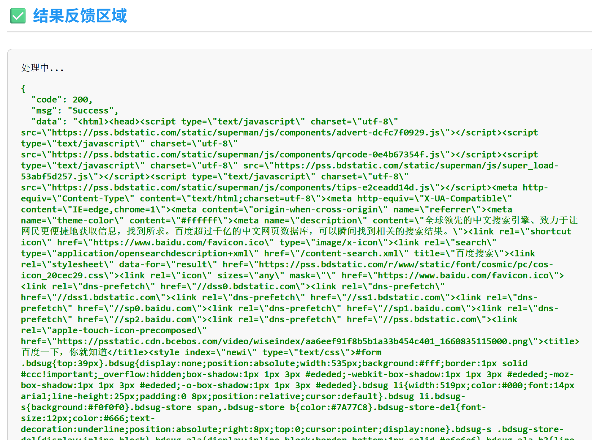

# Render Crawler

基于 **Selenium** 的动态渲染爬虫，可获取 **JS 渲染后的完整网页数据**

解决直接发起 HTTP 请求无法加载前端渲染内容的问题。


## 🍕  在线体验

海外服务器，延迟比较高

https://rc.carpcap.com/

## 🌭  快速搭建


比如：通过http直接请求baidu
返回结果大概是这样的，本身因为没有任何请求头以及js执行，本质只是一次get请求

```
<html>
<head><title>301 Moved Permanently</title></head>
<body>
<center><h1>301 Moved Permanently</h1></center>
<hr/>Powered by Tengine<hr><center>tengine</center>
</body>
</html>
```

但如果通过 Render Crawler 




---

## 🐳  快速搭建

docker-compose.yml
```docker
version: '3.3'
services:
  render-crawler:
    image: carpcap/render-crawler
    container_name: render-crawler
    environment:
      # Node 容器可以同时处理 6 个会话
      - SE_NODE_MAX_SESSIONS=6
      # 客户端请求新会话的最大等待时间
      # - SE_NODE_SESSION_TIMEOUT=300
    shm_size: 2g
    ports:
      - "10034:10034"
      # - "4444:4444" # 控制端口
      # - "5900:5900" # nvc端口
      # - "7900:7900" # 浏览器端口 默认密码secret
```

访问地址  http://127.0.0.1:10034

swagger http://127.0.0.1:10034/swagger/index.html


## 🚀 代理

代码中内置了 **两套代理池**，用以区分代理策略：

proxy_pool.go

* **CnProxyPool** —— 国内代理池
* **IntlProxyPool** —— 国外代理池

你需要自行实现其中的 `replenish` 方法（项目内已提供示例）。

---

## 🔧 自行编译

项目提供了 `build.ps1` go打包脚本  `Dockerfile`，你可以在修改代码后重新构建镜像：


```cmd
.\build.ps1
```

```bash
docker build -t render-crawler .
```


---

